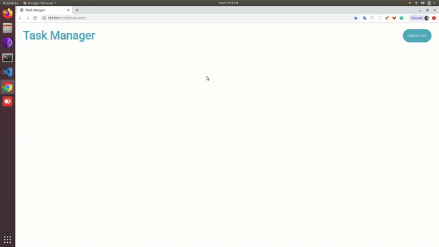

This application is made using pure VanillaJs.


## Instructions

- Install live-server & hit ```live-server``` command 

## Description
 Task-manager app made using HTML Canvas & Javascript. 

It's a basic task-manger application which has following functionality:

``` 
    - Create List
    - Delete List
    - Add task
    - Delete task
    - Edit task
    - Update status
    - Drag-Drop tasks among multiple task List
```

Demo

